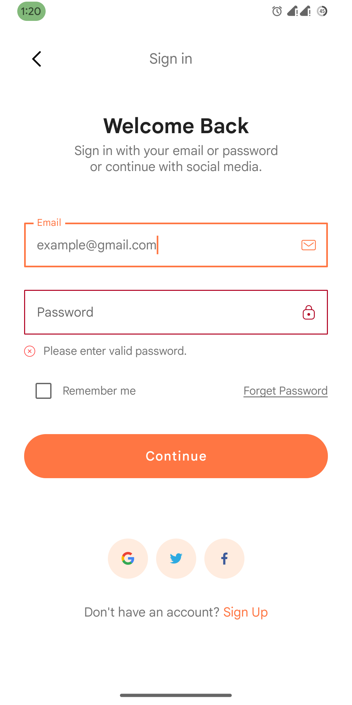
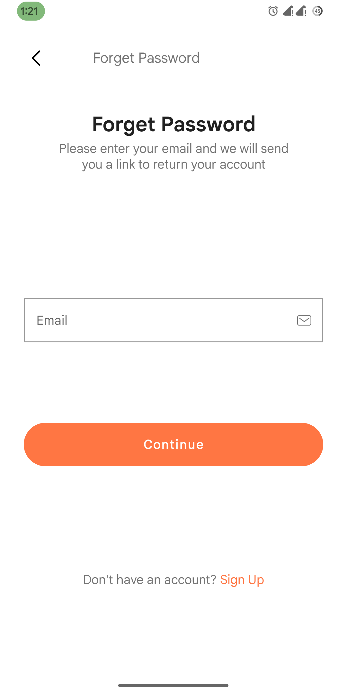
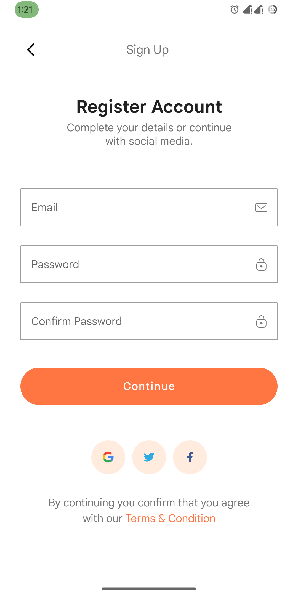
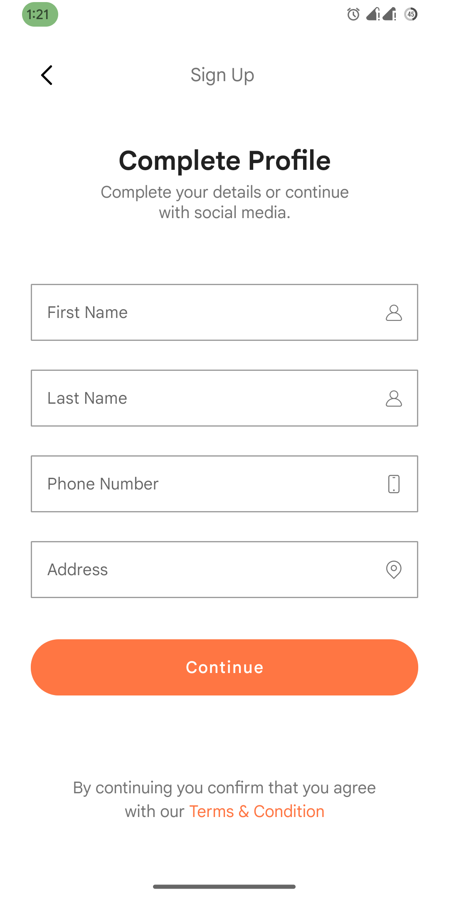
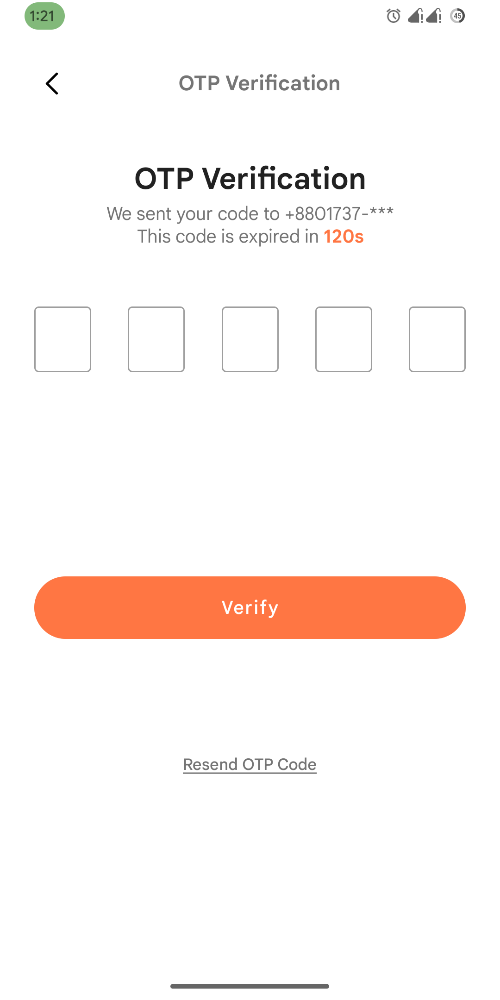
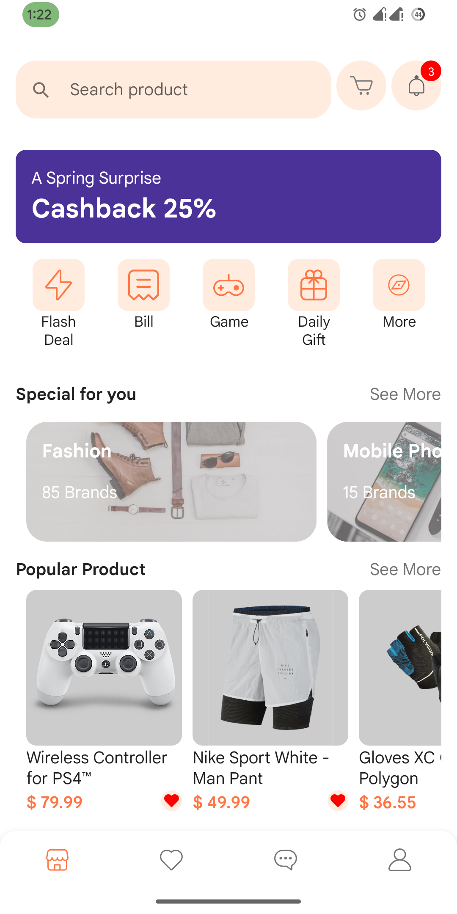
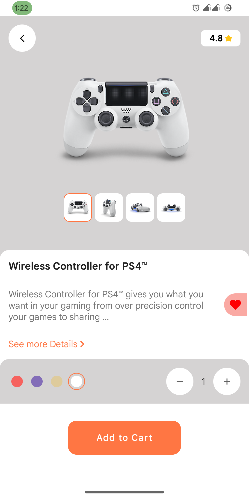
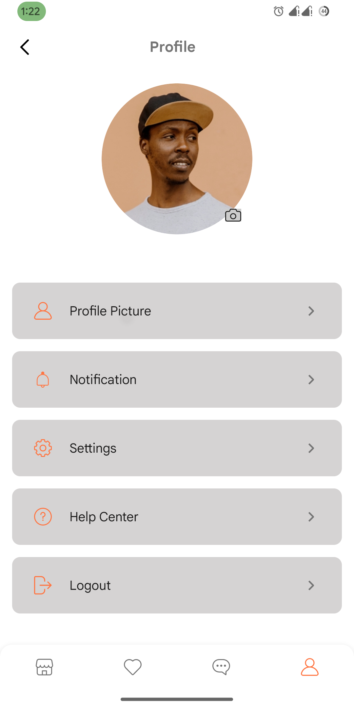

# BuyNest
This app is developed using new Android Libary Jetpack Compose. This porject was manily build for implementing the core concenpt of Jetpak Compose with cool animations. Here I have used Google Suggested pattern & try to follow the Best Practices such as:

1. Clearn Architecture
2. Nested NavController with a single NavHost.

## Used Library:
1. [Dagger Hilt](https://github.com/google/dagger)
2. [Coroutine](https://github.com/Kotlin/kotlinx.coroutines)

## Screens:
1. Onboarding
2. Login
3. Forgot Password
4. Sign Up
5. Complete Profile
6. OTP Verification
7. Home Page
8. Product Details
9. Order
10. Profile 
11. Bottom Navigation Bar

## 📸Preview

### Screenshot Preview
|----|----|----|----|
|||||
|||||||

